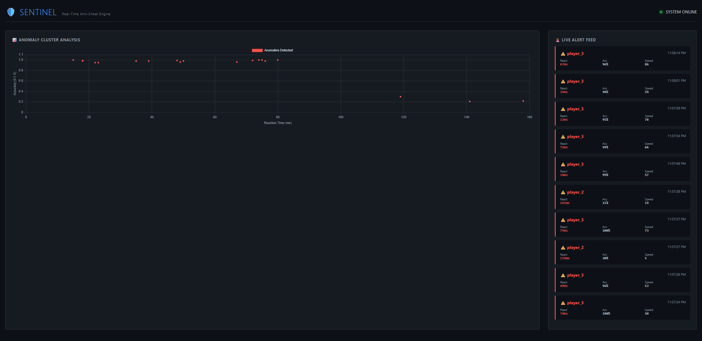

# Project Sentinel: Real-Time High-Velocity Anomaly Detection



## 🔍 Executive Summary
**Project Sentinel** is a real-time anomaly detection engine designed to process high-frequency telemetry streams. While demonstrated here as an **Anti-Cheat Engine** for gaming (detecting aimbots), the underlying architecture mimics **High-Frequency Trading (HFT)** and **Credit Card Fraud Detection** systems used in FinTech.

It ingests **50+ events per second**, processes them through an **Unsupervised Machine Learning model (Isolation Forest)**, and broadcasts alerts to a live dashboard with **sub-100ms latency**.

## 🏗️ Architecture
The system follows a decoupled **Microservices Architecture**:

1.  **Producer (Python):** Simulates high-velocity user telemetry (Reaction Time, Mouse Velocity, Accuracy). Includes drift simulation (Legit Pro Players vs. Cheaters).
2.  **Message Broker (Apache Kafka):** Buffers streams to ensure zero data loss during traffic spikes.
3.  **Detector (Scikit-Learn):** Consumes events, runs inference against a pre-trained Isolation Forest model, and flags statistical outliers.
4.  **API (FastAPI):** Async backend that pushes alerts to the frontend via WebSockets.
5.  **Dashboard (Vue 3 + Chart.js):** Visualizes live clusters of anomalies in real-time.

## 🚀 How to Run (Local Dev)

**Prerequisites:** Docker Desktop, Python 3.9+, Node.js

### 1. Start Infrastructure (Kafka & Zookeeper)
```bash
docker-compose up -d

*Wait for containers to become "Healthy".*
```

### 2. Start the Backend Services
(Open 3 separate terminals)

**Terminal 1: The Game Producer**
```bash
# Generates live data
python services/producer/main.py
```

**Terminal 2: The Detection Engine**
```bash
# Analyzes data in real-time
python services/detector/main.py
```

**Terminal 3: The API & WebSockets**
```bash
# Broadcasts alerts
uvicorn services.api.main:app --reload --port 8000
```

### 3. Start the Frontend Dashboard
**Terminal 4:**
```bash
cd frontend
npm run dev
```
Access the dashboard at: `http://localhost:5173`

## 🧠 The AI Model logic
We use an **Isolation Forest** algorithm because it is effective at detecting anomalies in high-dimensional datasets without needing labeled "fraud" data (Unsupervised Learning).
*   **Features:** Reaction Time (ms), Mouse Speed (px/tick), Accuracy (%).
*   **Drift Handling:** The model is trained to distinguish between "High Skill Players" (Legit Outliers) and "Inhuman Machines" (True Anomalies).

## 🛠️ Tech Stack
*   **Infrastructure:** Docker, Apache Kafka, Zookeeper
*   **Backend:** Python, FastAPI, Scikit-Learn, NumPy, Pandas
*   **Frontend:** Vue 3, Chart.js, WebSockets
